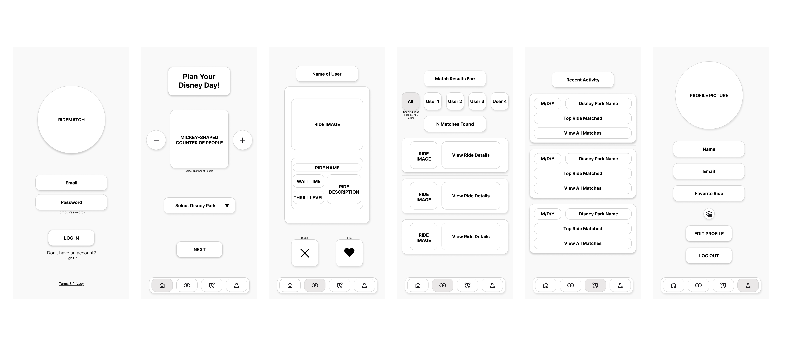

# RideTogether iOS App by Lucas Lopez 🎢  
*A Disney-inspired app that helps friends and families decide which rides to enjoy together at the parks.*

  
  
  
  
  

---

## Vision  
**For Disney Park Lovers, by a Disney Park Lover.**  
RideTogether solves the problem of group indecision when visiting parks by using a fun swipe-based matching system.  

- **Convenient**: no more long debates in line.  
- **Community**: plan rides together with friends/family.  
- **Magical & Minimalistic**: Disney-inspired aesthetic and streamlined UX.

---

## Features (MVP)  
- User sign-up and login (via Back4App)  
- Swipe left/right to like or skip rides  
- Real-time matching: find common rides your group likes  
- Ride details: images, descriptions, park info  
- Live ride wait times and operating status (ThemeParks.wiki API)  
- Support for groups of at least 2 people  
- Filtered Match Results: users can view matches per participants or view all matches combined
- Revent Activity history showing past park sessions

---

## Tech Stack  
- **Frontend**: Swift + SwiftUI  
- **Backend**: Back4App (Parse)  
- **External Ride Data API**: [ThemeParks.wiki](https://themeparks.wiki/api) (parks, rides, wait times)  
- **Custom Data**: Stored in Back4App (ride descriptions, images, thrill levels)  
- **Design**: Figma (Wireframes, UI Kit, Prototype)  
- **Version Control**: GitHub  

---

## Data Strategy
RideTogether integrates **ThemeParks.wiki API** for live park/ride information and augments it with a **custom dataset** stored in Back4App.  

**From ThemeParks.wiki API:**  
- Park information (IDs, names, locations)  
- Ride/attraction names  
- Wait times and status (open/closed)  

**From Back4App dataset:**  
- Ride descriptions (curated text)  
- Ride images (hosted URLs)  
- Thrill level classification ("Mild," "Moderate," "Thrill")  

---

## Information Architecture  
- **Intro Screen** → Sign up / Login  
- **Park + Group Setup** → Choose park + number of people  
- **Swipe Deck Screen** → Swipe through ride cards (image + description + wait time)  
- **Match Screen** → Display matched rides for group
    - Filter Options: *view matches by each user or ALL users combined*
- **Recent Activity** → View past matches 
- **Profile / Settings** → Edit into, view favorite park, log out

---

## Wireframes  
- [View Lo-Fi Wireframes](Documents/Wireframes/RideTogether_LoFi.pdf)
- [View Mid-Fi Wireframes](Documents/Wireframes/RideTogether_MidFi.pdf)

  
   
  <em>Figure 1 – RideTogether Mid-Fidelity Wireframes showing Login → Profile flow</em>

---

## UI Design System  
- **Typography**: Playful header font + clean body type  
- **Color Palette**:  
  - Primary: Royal Blue (#0053A0)  
  - Secondary: Magic Gold (#FFC857)  
  - Accent: Enchanted Pink (#FF6B81)  
  - Neutral: White / Light Gray  
- **Spacing & Grid**: 8 pt baseline, 4-column grid for cards  
- **Components**: Buttons, Cards, Forms, Modals, Navigation Bars, Swipe Deck  

*(TBC: Figma Style Guide + UI Kit)*  

---

## Database Schema (Parse Classes on Back4App)  
**User** (extends _User)  
- name : String  
- age : Number (optional)  
- favoritePark : String  

**Ride**  
- name : String  
- park : String  
- waitTime : Number (from ThemeParks API)  
- status : String ("open", "closed")  
- description : String (custom)  
- imageURL : String (custom)  
- thrillLevel : String ("Mild," "Moderate," "Thrill")  

**Preference**  
- user : Pointer → User  
- ride : Pointer → Ride  
- liked : Boolean  

**Match**  
- ride : Pointer → Ride  
- users : Array of Pointers → User  
- timestamp : Date  

---

## API / Query Playbook  
**Sample Operations:**  
- Fetch parks from ThemeParks.wiki → display park selector  
- Fetch rides + wait times by park → enrich with custom Back4App fields 
- Save user swipe → create Preference entry  
- Compute matched rides: query Preferences for all users in group → find intersection → create Match entry  
- Fetch recent matches for user  

---

## Testing Plan  
- Unit Tests (XCTest)  
- UI Tests (XCUITest)  
- Beta Test via TestFlight  

---

## Project Status  
- [X] Product Definition  
- [X] Wireframes  
- [ ] UI Kit in Figma  
- [ ] External API integrated (ThemeParks.wiki)  
- [ ] Custom Back4App dataset seeded  
- [ ] Backend schema created on Back4App  
- [ ] Authentication Flow implemented  
- [ ] Swipe/Ride Card Feature implemented  
- [ ] Matching Logic implemented  
- [ ] Polished UI/UX  
- [ ] Beta Testing  

---

## License  
Copyright [2025] [Lucas Lopez]

Licensed under the Apache License, Version 2.0 (the "License");
you may not use this file except in compliance with the License.
You may obtain a copy of the License at

    http://www.apache.org/licenses/LICENSE-2.0

Unless required by applicable law or agreed to in writing, software
distributed under the License is distributed on an "AS IS" BASIS,
WITHOUT WARRANTIES OR CONDITIONS OF ANY KIND, either express or implied.
See the License for the specific language governing permissions and
limitations under the License.
 
